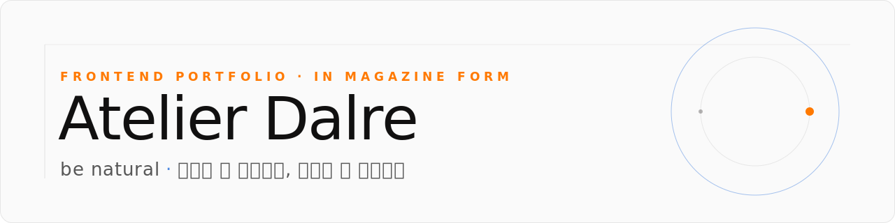

<div align="center">

<picture>
  <source media="(prefers-color-scheme: dark)" srcset="./assets/banner.svg" />
  <source media="(prefers-color-scheme: light)" srcset="./assets/banner-light.svg" />
  
</picture>

**Frontend Developer 유수빈의 개인 포트폴리오 — 작업·디자인 시스템·회고가 한곳에 모이는 작업실.**

> _복잡한 걸 단순하게, 단순한 걸 아름답게._ ✦

**[ ✦ Live — atelier-dalre.vercel.app ✦ ](https://atelier-dalre.vercel.app/)**

</div>

---

## Overview

Next.js 16 App Router 기반 정적 포트폴리오. GSAP로 스크롤·인트로 인터랙션을, `next-themes`로 다크/라이트 테마를, Turborepo + pnpm workspace로 모노레포 구조를 가져갑니다. 브랜드 컨셉은 **Atelier(작업실)** — 단순한 프로젝트 리스트가 아니라 작업·회고·디자인 시스템·글까지 한 공간에서 흐름으로 보여주는 것을 지향합니다.

## Site Map

| 페이지            | 경로           | 설명                                                                 |
| ----------------- | -------------- | -------------------------------------------------------------------- |
| **Home**          | `/`            | 비주얼 히어로 + About 인트로 + Work + Design System + Creation |
| **About**         | `/about`       | 자기소개 · 이력 · 관심 영역                                          |
| **Work**          | `/work`        | 프로젝트 목록                                                        |
| **Work Detail**   | `/work/[slug]` | 프로젝트별 Highlights · 회고 · Retro Keywords                        |
| **Design System** | `/design`      | 자체 컴포넌트 라이브러리 카탈로그                                    |

## Tech Stack

| Layer         | Stack                                                    |
| ------------- | -------------------------------------------------------- |
| **Framework** | Next.js 16 (App Router, RSC) · React 19                  |
| **Language**  | TypeScript 5                                             |
| **Styling**   | Tailwind CSS v4 · `clsx`                                 |
| **Animation** | GSAP 3 (Visual hero, Section In, scroll-triggered loops) |
| **Theming**   | `next-themes` (class strategy)                           |
| **Tooling**   | Turborepo · pnpm workspace · Prettier · ESLint           |

## Project Structure

```
atelier-dalre/
├─ apps/
│  └─ web/                        # Next.js 16 portfolio app
│     ├─ src/
│     │  ├─ app/
│     │  │  ├─ (main)/            # 메인 페이지 (홈)
│     │  │  ├─ about/             # About 페이지
│     │  │  ├─ work/              # /work, /work/[slug]
│     │  │  └─ design/            # 디자인 시스템 카탈로그
│     │  ├─ components/
│     │  │  ├─ layout/            # header, footer, mega-menu-*, theme-toggle
│     │  │  └─ sections/          # section-visual, section-work, section-design ...
│     │  ├─ hooks/                # use-gsap-*, use-mega-menu
│     │  └─ models/               # project-data, design-system-data
│     └─ public/
└─ packages/
   ├─ ui/                         # 공용 UI 패키지
   └─ tsconfig/                   # 공용 TS 설정
```

## Getting Started

```bash
# 의존성 설치
pnpm install

# 개발 서버
pnpm dev
# → http://localhost:3000
```

## Scripts

| Command          | Description         |
| ---------------- | ------------------- |
| `pnpm dev`       | 로컬 개발 서버 실행 |
| `pnpm build`     | 프로덕션 빌드       |
| `pnpm lint`      | ESLint 실행         |
| `pnpm tsc:check` | 타입 체크           |
| `pnpm format`    | Prettier 포맷       |

## Highlights

- **Mega Menu Navigation** — Work / Design System은 hover로 펼쳐지는 메가 메뉴 구조. `use-mega-menu` 훅으로 open/close 타이밍을 제어합니다.
- **Project Hierarchy** — `priority` 필드(`hero` · `large` · `small`)로 Work 카드에 시각 위계를 부여하고, 진행중·시작 시점 기준으로 자동 정렬.
- **Retro Keywords** — 각 프로젝트 회고에서 뽑아낸 핵심 키워드를 카드 chip과 상세 페이지 aside에 노출.
- **GSAP Interactions** — 비주얼 히어로 글자 단위 등장, Section In 워터폴 텍스트, SVG 무한 로테이션 등 스크롤·로딩 인터랙션.

## Author

**유수빈 (SUBIN YOO)**
Frontend Developer

[](https://github.com/Da1re)

---

<div align="center">

<sub>✦ © 2026 Atelier Dalre — be natural, built with care. ✦</sub>

</div>
